# Concetti architetturali — Backend — Livello 2: Confronto con le alternative

## Minimal API vs Controller-based API

**Controller-based** (l'approccio "classico" ASP.NET MVC/Web API, quello che la maggior parte dei tutorial .NET insegna per primo):
```csharp
[ApiController]
[Route("api/[controller]")]
public class CustomersController : ControllerBase
{
    [HttpPost]
    public async Task<IActionResult> Create(CreateCustomerCommand cmd) { ... }
}
```
Il routing è dedotto da attributi e convenzioni (nome classe, nome metodo), il framework istanzia un Controller per ogni richiesta, e ci sono agganci come gli **Action Filter** per eseguire codice prima/dopo l'azione.

**Minimal API**:
```csharp
app.MapGroup("/api/customers")
   .MapPost("/", async (CreateCustomerCommand cmd, IMediator mediator) => { ... });
```
Nessuna classe, nessun attributo di routing: l'endpoint è una funzione, registrata esplicitamente. Non è "meno potente" — è un modello diverso, pensato per API pure (senza Razor Views) dove il boilerplate dei Controller (una classe per raggruppare metodi che in realtà non condividono stato) non porta benefici.

**Cosa guadagni**: meno codice cerimoniale, routing esplicito e leggibile in un unico posto per feature, nessuna "magia" di convenzione da imparare.
**Cosa perdi/cambia**: gli Action Filter non esistono — il loro ruolo (logica trasversale prima/dopo l'azione) è preso da altri meccanismi, tipicamente middleware globali o, se si usa CQRS/MediatR come in questo progetto, dai **pipeline behavior** (vedi sotto). Anche model binding e validazione automatica degli attributi (`[Required]`, ecc.) non sono automatici come in un Controller con `[ApiController]` — vanno gestiti esplicitamente (qui, con FluentValidation dentro la pipeline MediatR).

## Layered Architecture vs Clean/Onion Architecture vs Vertical Slice Architecture



### Layered Architecture (N-Tier)
Il modello più insegnato nei corsi introduttivi: `Controller → Service → Repository → Database`, con una cartella per ciascun layer che contiene classi di **tutte** le feature dell'app (`Services/CustomerService.cs`, `Services/OrderService.cs`, `Services/UserService.cs` tutti nella stessa cartella `Services/`).

- **Pro**: intuitivo, facile da spiegare, ogni layer ha una responsabilità chiara.
- **Contro**: per modificare una singola feature devi toccare file in 3-4 cartelle diverse, lontane tra loro nel filesystem. Il `Service` tende a diventare un "God Object" via via che l'app cresce (un `CustomerService` con 40 metodi dopo due anni di sviluppo).

### Clean Architecture / Onion Architecture
Estende il Layered aggiungendo una **regola di dipendenza esplicita**: il cerchio più interno (**Domain**: entità, regole di business pure) non deve dipendere da nulla di esterno; l'**Application** layer (use case, orchestrazione) dipende solo dal Domain; l'**Infrastructure** (EF Core, repository concreti, servizi esterni) implementa interfacce definite nel Domain/Application, così la dipendenza è "invertita" (Dependency Inversion Principle) — è l'Infrastructure che dipende dal Domain, non viceversa. Tipicamente realizzata con **progetti .csproj separati** per ogni cerchio, in modo che la regola sia imposta anche a livello di compilazione (Domain non può fisicamente referenziare Infrastructure).

- **Pro**: il dominio è testabile in isolamento, sostituire l'infrastruttura (es. cambiare database) tocca solo un progetto.
- **Contro**: overhead progettuale significativo (4+ progetti, mapping tra livelli, interfacce per tutto) che si ripaga solo su applicazioni grandi/di lunga vita con regole di business complesse. Su un CRUD relativamente diretto, è spesso più cerimonia che valore.

### Vertical Slice Architecture (questo progetto)
Capovolge il criterio di raggruppamento: invece di raggruppare per *tipo tecnico*, raggruppa per *funzionalità*. Ogni "fetta verticale" (`Features/Customers/CreateCustomer/`) contiene tutto ciò che serve per quella singola operazione, attraversando idealmente tutti i "livelli" della Layered Architecture ma vivendo in un'unica cartella.

- **Pro**: alta *coesione* — tutto il codice che cambia insieme sta vicino nel filesystem. Aggiungere/rimuovere una feature è quasi sempre isolato (aggiungi/rimuovi una cartella). Nessun `Service` monolitico: la logica di un'operazione vive in un solo Handler, non condiviso.
- **Contro**: se più feature condividono davvero la stessa logica di business (non solo accesso dati), quella logica va estratta consapevolmente in un helper condiviso — altrimenti rischio di duplicazione. Non impone regole di dipendenza rigide come Clean Architecture: nulla impedisce a un Handler di fare cose "sbagliate" architetturalmente, è una questione di disciplina del team più che di compilatore.

**Dove si colloca Tama**: Vertical Slice per l'organizzazione delle feature, con un piccolo strato condiviso (`_Shared/`) per repository/documenti/infrastruttura comune — un ibrido pragmatico, non un'implementazione purista di nessuno dei tre modelli da manuale. Non c'è alcuna separazione in progetti .csproj (tutto vive in `Tama.Api`), quindi non c'è nessuna regola di dipendenza imposta dal compilatore come in Clean Architecture — è imposta solo dalla convenzione "guarda come sono fatte le altre feature".

## CQRS + Mediator pattern



**CQRS** in questo progetto è applicato nella sua forma "leggera": non ci sono due database separati per letture e scritture (CQRS "pieno", tipico di sistemi ad altissima scala), ma solo una separazione di *tipo* a livello di codice: ogni operazione è o un `Command` (muta stato, es. `CreateCustomerCommand`) o una `Query` (legge, es. `GetCustomersQuery`), ciascuna con il proprio Handler dedicato — mai un metodo che fa entrambe le cose.

**Il Mediator pattern** (qui implementato dalla libreria MediatR) risolve un problema specifico: senza di esso, l'endpoint dovrebbe conoscere direttamente la classe Handler da istanziare e chiamare, creando un accoppiamento diretto. Con il mediatore, l'endpoint conosce solo `IMediator` e il tipo di Command/Query — è il mediatore (con la DI di ASP.NET Core) a risolvere quale Handler eseguire, cercandolo per tipo (`IRequestHandler<CreateCustomerCommand, CreateCustomerResponse>`). Effetto pratico: **l'Handler è, di fatto, il "Service"** che in un'architettura Layered avrebbe un nome tipo `CustomerService.CreateAsync()` — solo che qui ogni metodo del vecchio Service diventa una classe a sé stante.

## Pipeline behavior = Decorator pattern applicato


Il **Decorator pattern** classico "avvolge" un oggetto con un altro che ne estende il comportamento senza modificarne il codice. I **pipeline behavior** di MediatR sono un'applicazione diretta di questo pattern alla pipeline di elaborazione di un Command/Query: ogni behavior riceve il "prossimo passo" (`next`) come delegato, può eseguire codice prima di chiamarlo, e codice dopo aver ricevuto il risultato — esattamente come un middleware ASP.NET Core, ma applicato dentro MediatR invece che a livello HTTP.

Questo è il meccanismo che, in questo progetto, **sostituisce gli Action Filter** che avresti in un'architettura Controller-based: la validazione (`ValidationBehavior`) e il logging (`LoggingBehavior`) non sono agganciati alla request HTTP, ma alla request MediatR — funzionano identicamente sia che il Command arrivi da un endpoint HTTP, sia che venga inviato internamente da un altro Handler (se mai servisse).

## Repository pattern: con un Document DB è diverso che con un RDBMS

Il Repository pattern nasce storicamente per **disaccoppiare** il dominio da un ORM relazionale complesso (EF Core, NHibernate) e per rendere possibile mockare l'accesso dati nei test. Con MongoDB la situazione è diversa: `IMongoCollection<T>` è già di per sé un'interfaccia relativamente semplice e testabile (esistono anche driver in-memory per i test). Qui il Repository pattern serve soprattutto a:
- dare un **vocabolario di dominio** alle query (`GetPagedAsync(search, page, pageSize)` invece di costruire filtri Mongo ovunique serva),
- centralizzare in un solo posto la logica di query ripetuta per entità (regex di ricerca, ordinamento, paginazione).

Non c'è un **generic repository** (`IRepository<T>`) qui: ogni entità ha metodi specifici al proprio dominio, non un CRUD generico riusato via generics — scelta comune quando le query reali differiscono molto da entità a entità (customers cerca per nome/email, drafts filtra per stato, ecc.).

## Document-oriented (MongoDB) vs Relazionale

| Aspetto | Relazionale (SQL Server, PostgreSQL + EF Core) | Document-oriented (MongoDB, questo progetto) |
|---|---|---|
| Struttura dati | Tabelle con schema fisso, righe, foreign key | Documenti (BSON) con struttura flessibile, embedding invece di join |
| Relazioni | Join espliciti, vincoli di integrità referenziale a livello DB | Riferimenti "morbidi" (un `CustomerId: ObjectId` dentro un `DraftDocument`) senza vincoli imposti dal DB — l'integrità va garantita dal codice applicativo |
| Migration | Necessarie, versionate (EF Core Migrations) | Non necessarie in senso stretto: basta aggiungere un campo alla classe C#, i documenti vecchi semplicemente non lo hanno finché non vengono aggiornati (mitigato qui da `IgnoreExtraElementsConvention`) |
| Transazioni multi-entità | Native, ACID su più tabelle per default | Supportate da MongoDB solo su replica set (non su istanza standalone). Qui l'infrastruttura c'è (`IClientSessionHandle` passato ai repository nei cascade delete) ma le chiamate `StartTransaction`/`Commit` sono **commentate** nel codice: la pulizia a cascata è sequenziale, non atomica (vedi [backend-03](backend-03-nel-progetto.md)) |
| Denormalizzazione | Evitata (forme normali), i dati correlati si leggono con join | Prassi deliberata: si copiano *snapshot* di campi correlati dentro il documento (es. `CustomerName` dentro il preventivo) per leggere tutto con una sola query — al costo che la copia non si aggiorna da sola se l'originale cambia |
| Contatori progressivi | `IDENTITY`/`SEQUENCE` nativi del DB | Non esistono nativamente: si usa il **counter pattern** — una collection `counters` aggiornata con `FindOneAndUpdate` + `$inc` atomico (vedi [backend-03](backend-03-nel-progetto.md)) |
| Quando ha senso | Dati fortemente relazionali, invarianti forti da far rispettare al DB, reportistica complessa (SQL) | Dati che si evolvono spesso, letture prevalentemente per aggregato singolo (es. "dammi il preventivo con tutte le sue righe"), team piccolo che vuole iterare velocemente sullo schema |

## Dependency Injection: i tre lifetime e la trappola singleton→scoped

La DI di ASP.NET Core registra ogni servizio con un **lifetime** che ne governa la durata:

| Lifetime | Durata dell'istanza | Uso tipico |
|---|---|---|
| **Singleton** | Una sola per tutta la vita dell'app | Client thread-safe e costosi da creare (es. `IMongoClient`, `IMongoDatabase`) |
| **Scoped** | Una per richiesta HTTP | Servizi che lavorano nel contesto di una richiesta (es. i repository) |
| **Transient** | Una nuova a ogni risoluzione | Oggetti leggeri e senza stato (es. i pipeline behavior MediatR) |

La regola da conoscere è il vincolo di **captive dependency**: un servizio a vita lunga non può farsi iniettare nel costruttore un servizio a vita più corta (un singleton che cattura uno scoped lo terrebbe in vita per sempre, condividendolo tra richieste diverse — ASP.NET Core in ambiente di sviluppo lo rileva e lancia un'eccezione). Quando un componente singleton (come un middleware) ha *davvero* bisogno di un servizio scoped, la soluzione canonica è iniettare `IServiceScopeFactory` e creare uno scope esplicito al momento dell'uso — esattamente ciò che fa `ExceptionHandlingMiddleware` in questo progetto per salvare gli `ErrorLogDocument` (vedi [backend-03](backend-03-nel-progetto.md)).

## Claims-based authorization vs Role-based

Un modello **role-based** classico verificherebbe `[Authorize(Roles = "Admin")]` — un ruolo fisso, spesso codificato nell'attributo stesso. Il modello **claims-based** usato qui (`RequireClaim("permissions", "customers.write")`) verifica invece la presenza di un'affermazione specifica nel token, risolta dinamicamente al login sommando i permessi di tutti i ruoli/gruppi dell'utente. Il vantaggio: i permessi non sono "cablati" nel codice come stringhe di ruolo, e un utente può avere permessi granulari (es. `customers.read` ma non `customers.delete`) senza dover creare un ruolo apposito per ogni combinazione.
