# Concetti architetturali — Frontend — Livello 2: Confronto con le alternative

## Reattività fine-grained: il fondamento di tutto il resto

Prima di confrontare gli stili di API, vale la pena fissare il meccanismo su cui entrambi poggiano. In Vue, lo stato non è una semplice variabile: è avvolto in un contenitore osservabile (`ref(0)`, `reactive({...})`). Quando un template, una `computed` o un `watch` **leggono** quel valore, Vue registra silenziosamente la dipendenza ("questo pezzo di template dipende da `count`"); quando il valore **cambia**, Vue ri-esegue solo i punti registrati — non l'intero componente. È l'**Observer pattern** applicato in modo capillare, ed è la differenza strutturale rispetto a React, dove un cambio di stato ri-esegue l'intera funzione componente e il framework confronta il risultato (virtual DOM diffing) per capire cosa aggiornare.

Conseguenze pratiche per chi lavora su questo progetto:
- **Il binding è transitivo attraverso gli store**: quando `customers.store.ts` fa `items.value = result.items`, ogni componente che sta mostrando `store.items` si aggiorna da solo — nessun evento da emettere, nessun "notify" esplicito. Questo è ciò che rende il pattern MVVM (vedi sotto) così poco cerimonioso in Vue.
- **La trappola classica è rompere la reattività** copiando il valore fuori dal contenitore: `const items = store.items` (senza `ref`/`computed`/`storeToRefs`) cattura il valore corrente e non si aggiornerà più. È il motivo per cui nei componenti del progetto si accede sempre a `store.items` direttamente nel template, o tramite `computed`.
- `computed` non è solo zucchero: è **memoizzato** (ricalcola solo se le dipendenze cambiano), quindi è il posto giusto per derivazioni — mai tenere nello stato un dato derivabile da un altro (vedi Single Source of Truth, più sotto).

## Options API vs Composition API



**Options API** (il modo in cui Vue 2 funzionava, ancora disponibile in Vue 3):
```js
export default {
  data() { return { count: 0, user: null } },
  computed: { doubled() { return this.count * 2 } },
  methods: { increment() { this.count++ } },
  mounted() { this.fetchUser() }
}
```
Ogni "tipo" di logica (stato, computed, metodi, lifecycle) va in una sezione fissa dell'oggetto. Funziona bene su componenti piccoli, ma su componenti grandi **la logica di una singola funzionalità si disperde** tra `data`, `computed`, `methods` e `watch` — per capire tutto ciò che riguarda "il conteggio" devi saltare tra 4 sezioni diverse dello stesso file.

**Composition API** (usata in tutto questo progetto):
```ts
<script setup lang="ts">
const count = ref(0)
const doubled = computed(() => count.value * 2)
function increment() { count.value++ }
</script>
```
Qui tutto ciò che riguarda "il conteggio" (stato, computed, funzione) sta **fisicamente vicino** nel codice — stesso principio di coesione della Vertical Slice Architecture, applicato a livello di componente invece che di feature backend.

**Perché conviene qui**: componenti con form complessi (validazione, campi condizionali, chiamate multiple) come `UserDetailPage.vue` beneficiano di poter raggruppare "tutto ciò che riguarda il salvataggio" in un unico blocco (`form`, `saving`, `save()`) senza saltare tra sezioni. Il costo: chi viene da Vue 2/Options API deve disimparare l'abitudine di cercare `methods:` — qui i "metodi" sono semplicemente funzioni dichiarate nello `<script setup>`.

## Composable = equivalente Vue dei custom Hooks

Un composable (`usePermission()`, `useApiErrors()` in questo progetto) è per la Composition API quello che un **custom Hook** è per React: una funzione che incapsula logica stateful riusabile, richiamabile da più componenti senza duplicare codice, senza bisogno di un componente wrapper o di mixin (i mixin di Vue 2 avevano il problema di "collisioni di nomi" non tracciabili — i composable lo risolvono restituendo esplicitamente ciò che serve).

## Pinia (setup-syntax) vs Vuex vs Options-style Pinia

**Vuex** (il gestore di stato "storico" di Vue 2, ancora usabile ma non scelto qui) impone una struttura rigida: `state`, `getters`, `mutations` (le uniche autorizzate a modificare `state`, sempre sincrone), `actions` (possono essere asincrone, chiamano `mutations` per modificare lo stato). Questa separazione `mutations`/`actions` è un livello di indirection in più, pensato per rendere le modifiche di stato tracciabili (utile con Redux DevTools "time travel debugging").

**Pinia** (usato qui) semplifica: non ci sono `mutations` separate, le `actions` possono modificare lo stato direttamente. Ha due sintassi possibili:
- **Options-style** (`defineStore('id', { state: () => ({...}), actions: {...} })`) — simile a Vuex ma più semplice.
- **Setup-syntax** (`defineStore('id', () => { const x = ref(...); function doThing() {...}; return {x, doThing} })`) — **quella usata in questo progetto**, che rispecchia esattamente lo stile Composition API dei componenti: uno store è, concettualmente, "un composable che vive per tutta la durata dell'app invece che per la durata di un componente".

**Perché ha senso qui**: coerenza di stile — chi ha imparato a scrivere un componente con `<script setup>` sa già leggere uno store, perché la sintassi è la stessa (`ref`, funzioni, nessun `this`).

## MVVM applicato a una SPA


Mappatura concettuale:
- **View** = il componente `.vue` (template + parte reattiva dello script) — mostra dati, cattura eventi utente, non contiene business logic.
- **ViewModel** = lo store Pinia — tiene lo stato "di presentazione" (loading, error, paginazione, lista items) e orchestra le operazioni, facendo da intermediario tra View e Model.
- **Model** = il service layer (chiamate HTTP) + i tipi TypeScript che descrivono la forma dei dati.

Questo è esplicitamente **imposto come regola di progetto** (non solo una tendenza spontanea): il `CLAUDE.md` del frontend dichiara "nessuna logica di business nei componenti — tutto nello store o nei composable" e "nessuna chiamata axios/fetch diretta nei componenti o negli store — sempre tramite service". È l'equivalente frontend della regola "l'endpoint non contiene logica di business" lato backend (vedi documentazione concetti backend) — stesso principio di separazione delle responsabilità, applicato su entrambi i lati dello stack.

## Single Source of Truth

Principio: ogni dato ha **un solo proprietario autorevole** nello stato dell'app, e tutti gli altri punti che lo mostrano lo *derivano* da lì invece di tenerne una copia. Nel progetto il proprietario è quasi sempre lo store Pinia: la lista clienti vive solo in `customers.store.ts`, i permessi dell'utente solo in `auth.store.ts` — un componente non copia mai `store.items` in un proprio `ref` locale, lo legge direttamente (o tramite `computed`).

La violazione tipica da evitare: duplicare nello stato ciò che è derivabile. Se hai `items` e ti serve "quanti sono attivi", la risposta è `computed(() => items.value.filter(x => x.isActive).length)` — **non** un secondo `ref` `activeCount` da tenere manualmente allineato (prima o poi qualcuno aggiorna uno e dimentica l'altro). Grazie alla memoizzazione di `computed` (vedi sezione sulla reattività), la derivazione non costa nulla in più.

Nota il contrasto interessante con il backend: lato Mongo il progetto **denormalizza deliberatamente** (copia `CustomerName` dentro il preventivo — vedi documentazione concetti backend), lato frontend fa l'opposto. Non è incoerenza: sono contesti diversi. Sul DB la copia è uno snapshot storico voluto e persistente; nello stato UI una copia è solo un'occasione di disallineamento durante la sessione, senza alcun beneficio (la reattività rende la derivazione gratuita).

## Interceptor pattern (HTTP)

Un **interceptor** applicato a un client HTTP è concettualmente lo stesso pattern dei **middleware** ASP.NET Core o dei **pipeline behavior** MediatR visti lato backend: un punto centrale attraverso cui passa *ogni* richiesta/risposta, dove puoi inserire comportamento trasversale (autenticazione, gestione errori) senza doverlo ripetere in ogni singola chiamata. È lo stesso principio del Decorator pattern, applicato qui al livello del client HTTP invece che al livello del server.

**Alternativa senza interceptor**: ogni service dovrebbe aggiungere manualmente l'header `Authorization` e gestire il proprio `catch` per i 401 — duplicazione che cresce linearmente col numero di service (in questo progetto, 19+).

## Optimistic update vs re-fetch

Due strategie diverse, entrambe presenti nel progetto (vedi `customers.store.ts`):
- **Re-fetch** (`create`/`update` → richiamano `fetchAll()`): più semplice da ragionare, sempre coerente col server, ma un round-trip HTTP in più.
- **Optimistic update** (`remove` → filtra `items` localmente senza richiamare il server): percepito come più reattivo (nessuna attesa visibile), ma richiede di gestire il caso di rollback se l'operazione fallisce **dopo** aver già aggiornato la UI (qui mitigato dal fatto che `remove()` aggiorna `items` solo *dopo* che la chiamata `delete` ha avuto successo — quindi non è "ottimistico" in senso stretto, ma un aggiornamento locale post-conferma che evita un secondo giro di rete).

## Route guard: dove si applica la sicurezza "a due livelli"

Un `beforeEach` guard blocca la **navigazione**, ma non è l'unico posto dove viene applicata la sicurezza — è solo la prima linea di difesa, puramente per esperienza utente (evita di mostrare una pagina per poi scoprire che l'azione fallisce). La vera autorizzazione, quella che conta per la sicurezza, è sempre verificata **anche** lato backend (claim `permissions` sul JWT, vedi documentazione concetti backend) — il guard frontend nasconde/reindirizza, il backend rifiuta. Questo doppio livello (UI nasconde per UX, server rifiuta per sicurezza) è un principio generale valido per qualunque SPA, non specifico di Vue.
