# Tama — Documentazione tecnica

Documentazione per sviluppatori con basi di .NET e Vue che non conoscono ancora questo progetto specifico. Obiettivo: poter intervenire e modificare il codice in autonomia e senza rischi.

Ogni area (backend/frontend) è organizzata su 3 livelli, dal più astratto al più concreto:
- **Livello 1 — Panoramica**: elenco tecnologie/librerie e ruolo di ciascuna, senza dettagli implementativi.
- **Livello 2 — Funzionamento**: come le tecnologie sono organizzate e collegate in *questo* progetto, con diagrammi.
- **Livello 3 — Dettaglio**: codice reale, esempi end-to-end, convenzioni per aggiungere codice in sicurezza.

> Per capire **perché** il progetto ha scelto queste architetture (Minimal API vs Controller, Vertical Slice vs Clean/Onion Architecture, Composition API vs Options API, ecc.) e come si confrontano con le alternative più comuni, vedi la documentazione separata [../architecture/00-indice.md](../architecture/00-indice.md).

## Documenti

| Documento | Contenuto |
|---|---|
| [backend-01-panoramica](backend-01-panoramica.md) | Tecnologie backend: .NET 10, MediatR, FluentValidation, MongoDB.Driver, JWT/MSAL, ecc. |
| [backend-02-funzionamento](backend-02-funzionamento.md) | Struttura "vertical slice" per feature, pipeline richiesta HTTP, MediatR+behaviors, repository MongoDB, auth JWT/MSAL, autorizzazione a permessi, gestione errori |
| [backend-03-dettaglio](backend-03-dettaglio.md) | Endpoint completo (Customers), gestione eccezioni, motore di stampa preventivo .docx, come aggiungere una feature |
| [frontend-01-panoramica](frontend-01-panoramica.md) | Tecnologie frontend: Vue 3 Composition API, Vuetify 3, Pinia, vue-router, axios, MSAL browser |
| [frontend-02-funzionamento](frontend-02-funzionamento.md) | Struttura cartelle, routing e guardie, Pinia setup-syntax, service layer, client axios centralizzato |
| [frontend-03-dettaglio](frontend-03-dettaglio.md) | Store e pagina lista CRUD completi (Customers), form Create/Edit (Users), come aggiungere una view |

> Ogni documento è disponibile anche in versione `.html` autonoma (stesso nome, diagrammi Mermaid inclusi come SVG statici, nessuna dipendenza esterna).

## Documenti pre-esistenti nel repo (correlati)

- `docs/Authentication-Strategy.md` — approfondimento dedicato al confronto JWT vs MSAL, usato come fonte per le sezioni di autenticazione qui documentate.
- `docs/Deploy-Render.md`, `docs/Azure-App-Registration.md` — deploy e configurazione Azure AD (fuori scopo di questa documentazione tecnica del codice).

## Panoramica architetturale

L'applicazione è un **monorepo Nx** con due app: `apps/backend` (Tama.Api, .NET 10 Minimal API) e `apps/frontend` (Vue 3 + Vuetify 3, Vite). Il backend espone una REST API su MongoDB; il frontend è una SPA che consuma quella API via axios, con autenticazione JWT (login locale o, in alternativa, login Azure AD/MSAL che comunque produce sempre un JWT interno).

**Come leggere il diagramma**: le frecce continue rappresentano il traffico applicativo ordinario (ogni richiesta autenticata porta un Bearer JWT interno); le frecce tratteggiate rappresentano il flusso di login Azure AD, che avviene **solo** se il frontend è configurato con `VITE_AUTH_STRATEGY=msal` — è un percorso alternativo di autenticazione iniziale, non parte del traffico applicativo regolare.

## Flussi end-to-end usati come esempio ricorrente

Per rendere concreta la documentazione, tre flussi reali del codice sono ripresi più volte nei documenti di livello 2/3:

1. **CRUD Clienti (Customers)** — esempio di vertical slice CRUD standard, lato backend (`Features/Customers/`) e frontend (`stores/customers.store.ts`, `pages/data/CustomersPage.vue`).
2. **Login (JWT vs MSAL)** — flusso di autenticazione a doppia strategia, con generazione di un JWT interno unico indipendentemente dal metodo di login iniziale.
3. **Generazione preventivo (.docx)** — feature di business non banale: manipolazione diretta dell'XML OOXML dentro un file Word, con token `{{...}}` e blocchi ripetibili `{{POS_START}}`/`{{POS_END}}` per le righe del preventivo.

## Punti di attenzione emersi dall'analisi (TODO da verificare col team)

- **SkiaSharp** è una dipendenza NuGet dichiarata (`Tama.Api.csproj`) ma nessun utilizzo è stato trovato nel codice — verificare se residua da una funzionalità non ancora implementata.
- **Indici MongoDB**: `EnsureIndexesAsync` crea indici solo per 6 collection (`users`, `accessories`, `series`, `drafts`, `counters`, `refreshTokens`); `customers`, `templates`, `roles`, `permissions`, `groups`, `auditLogs`, `errorLogs` non hanno indici espliciti.
- **`watch(..., { debounce: 300 } as any)`** in `CustomersPage.vue`: l'opzione `debounce` non è nativa dell'API `watch` di Vue 3 (da cui il cast `as any`) — il progetto usa altrove `watchDebounced` di `@vueuse/core` per lo stesso scopo; verificare se qui il debounce funziona davvero o va corretto.
- **Nessun error handler JS globale** nel frontend (`window.onerror`/`app.config.errorHandler`/`unhandledrejection`): solo le risposte HTTP 5xx vengono inviate automaticamente come `ErrorLog` al backend, eccezioni runtime non legate ad axios non vengono catturate.
- **`types/api.types.ts`** (frontend) è mantenuto manualmente in parallelo ai DTO C# — nessuna generazione automatica da OpenAPI, rischio di disallineamento silenzioso quando cambia un contratto API.
