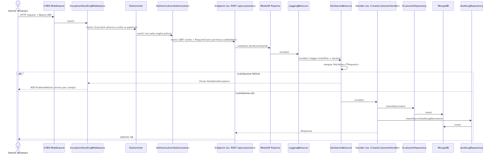

# Backend — Livello 2: Come funziona

## Architettura: "vertical slice" per feature

Il progetto **non** usa layer orizzontali classici (Controllers/Services/Repositories separati per tutta l'app). Ogni funzionalità di dominio ha una cartella propria sotto `Features/`, e dentro quella cartella ci sono **tutte** le classi necessarie per quella singola operazione: Command/Query, Handler, Validator, Response.

```
Features/
├── Customers/
│   ├── CustomerEndpoints.cs        ← registra le route HTTP della feature
│   ├── CreateCustomer/
│   │   ├── CreateCustomerCommand.cs
│   │   ├── CreateCustomerHandler.cs
│   │   ├── CreateCustomerResponse.cs
│   │   └── CreateCustomerValidator.cs
│   ├── UpdateCustomer/  (stessa struttura)
│   ├── DeleteCustomer/  (senza Validator: nessuna regola necessaria)
│   ├── GetCustomerById/ (query, nessun Validator)
│   └── GetCustomers/    (query, nessun Validator)
├── Drafts/, Users/, Roles/, Groups/, Permissions/, Series/,
│   Accessories/, Glazing/, WindowTypes/, WindowSystems/, RalColors/,
│   Templates/, AuditLogs/, ErrorLogs/, SystemConfig/, Monitoring/, Auth/
└── _Shared/                        ← tutto ciò che è cross-cutting
    ├── Documents/                  ← POCO Mongo (uno per entità)
    ├── Repositories/               ← interfaccia + implementazione MongoDB per entità
    ├── Behaviors/                  ← LoggingBehavior, ValidationBehavior (pipeline MediatR)
    ├── Extensions/                 ← Mongo, MediatR, Auth, Endpoint, Repository registration
    ├── Middleware/                 ← ExceptionHandlingMiddleware
    ├── Exceptions/                 ← NotFoundException, ConflictException, ecc.
    ├── Seed/                       ← DataSeeder + template .docx embedded
    └── Assets/WindowTypes/         ← immagini .png embedded
```



**Regola pratica**: quando cerchi "dove sta la logica di X", cerca prima `Features/X/` — troverai lì il 90% del codice rilevante. Solo repository, documenti Mongo e infrastruttura condivisa sono in `_Shared/`.

## Registrazione degli endpoint: nessuna auto-discovery

A differenza di framework con scansione automatica per assembly, qui la registrazione è **esplicita e manuale**. Ogni feature espone un extension method `MapXEndpoints(IEndpointRouteBuilder)`, e tutti vengono richiamati da un unico punto:

`Features/_Shared/Extensions/EndpointExtensions.cs`:
```csharp
public static void MapAllEndpoints(this WebApplication app)
{
    app.MapAuthEndpoints();
    app.MapUserEndpoints();
    // ... una riga per ogni feature
    app.MapDraftEndpoints();
    app.MapTemplateEndpoints();
}
```
chiamato da `Program.cs`: `app.MapAllEndpoints();`.

**Conseguenza pratica**: se aggiungi una nuova feature con i suoi endpoint e dimentichi di aggiungere la riga qui, gli endpoint semplicemente non esistono a runtime (nessun errore a build time).

## Pipeline di una richiesta HTTP



Ordine dei middleware in `Program.cs` (l'ordine è significativo in ASP.NET Core):

1. `app.UseCors()` — deve essere il primo, gestisce anche le preflight OPTIONS.
2. `app.UseMiddleware<ExceptionHandlingMiddleware>()` — cattura **tutte** le eccezioni non gestite a valle, comprese quelle lanciate dalla pipeline MediatR.
3. `app.MapOpenApi()` / Scalar / Swagger UI — documentazione, non nel path delle richieste applicative.
4. `app.UseRateLimiter()`.
5. `app.UseRequestLocalization()`.
6. `app.UseAuthentication()` → `app.UseAuthorization()`.
7. `app.MapAllEndpoints()` — qui la richiesta arriva finalmente all'endpoint specifico.

Dentro l'endpoint, il flusso è sempre lo stesso pattern:
```csharp
group.MapPost("/", async (CreateCustomerCommand command, IMediator mediator, CancellationToken ct) =>
{
    var result = await mediator.Send(command, ct);
    return Results.Created($"/api/customers/{result.Id}", result);
})
.RequireAuthorization(p => p.RequireClaim("permissions", "customers.write"));
```
L'endpoint **non contiene logica di business**: il suo unico compito è fare binding dell'input, inviarlo a MediatR e mappare il risultato in una risposta HTTP.

## Pipeline MediatR e behaviors

Registrazione in `Features/_Shared/Extensions/MediatRExtensions.cs`:
```csharp
services.AddMediatR(cfg => cfg.RegisterServicesFromAssemblyContaining<Program>());
services.AddTransient(typeof(IPipelineBehavior<,>), typeof(LoggingBehavior<,>));
services.AddTransient(typeof(IPipelineBehavior<,>), typeof(ValidationBehavior<,>));
services.AddValidatorsFromAssemblyContaining<Program>();
```
L'**ordine di registrazione determina l'ordine di esecuzione**: `LoggingBehavior` avvolge `ValidationBehavior`, che avvolge l'Handler vero e proprio. Quindi per ogni Command/Query:

1. `LoggingBehavior` logga inizio (con `Stopwatch`), poi chiama `next()`.
2. `ValidationBehavior` esegue tutti gli `IValidator<TRequest>` registrati per quel tipo; se falliscono, lancia `FluentValidation.ValidationException` **senza chiamare l'Handler**.
3. Se la validazione passa, viene eseguito l'Handler.
4. `LoggingBehavior` logga la fine/durata (anche in caso di eccezione, che viene ri-lanciata dopo il log).

I Validator sono scoperti automaticamente per assembly-scan (`AddValidatorsFromAssemblyContaining`): non serve registrarli uno per uno.

## Accesso ai dati: repository diretti su MongoDB

Non c'è un livello di astrazione generico (`IRepository<T>`): ogni entità ha la propria coppia interfaccia/implementazione in `Features/_Shared/Repositories/` (es. `ICustomerRepository` / `CustomerRepository`), iniettata via DI e registrata manualmente in `RepositoryExtensions.AddRepositories()` (24 repository elencati uno per uno con `AddScoped`).

Il pattern tipico del repository:
- riceve `IMongoDatabase` nel costruttore (primary constructor C#) e ottiene la collection tipizzata: `db.GetCollection<CustomerDocument>("customers")`.
- espone metodi specifici al dominio (`GetPagedAsync`, `GetByEmailAsync`, ecc.), non un CRUD generico.
- la ricerca testuale è fatta con `BsonRegularExpression` case-insensitive su `Builders<T>.Filter.Regex`, non con un motore di full-text search dedicato.

Il **ConventionPack** globale (registrato in `AddMongoDb`) applica a tutti i documenti: nomi campo camelCase, ignora campi extra nel documento non mappati nella classe C#, ed enum serializzati come stringa (non come intero).

Gli **indici** vengono creati programmaticamente a ogni avvio tramite `EnsureIndexesAsync(app)`, chiamato dopo `MapAllEndpoints()` in `Program.cs`. È idempotente (Mongo non ricrea un indice già esistente con lo stesso nome).

> ⚠️ **TODO/gap rilevato**: `EnsureIndexesAsync` crea indici solo per le collection `users`, `accessories`, `series`, `drafts`, `counters`, `refreshTokens`. Non risultano indici per `customers`, `templates`, `roles`, `permissions`, `groups`, `auditLogs`, `errorLogs`. Da verificare se è intenzionale (collection piccole, non serve indicizzare) o una lacuna da colmare, specie se `customers` cresce.

## Dipendenze tra "layer" logici



## Autenticazione: due strategie di login, un solo sistema di token

Il sistema supporta due modi per **autenticarsi la prima volta**, ma dopo il login il comportamento è identico. Riferimento completo: `docs/Authentication-Strategy.md` (già presente nel repo), confermato leggendo `Features/_Shared/Extensions/AuthExtensions.cs` e `Features/Auth/`.

- **JWT locale** (`POST /api/auth/login`): email + password, verificata con `BCrypt.Verify`. Vedi `Features/Auth/Login/LoginHandler.cs`.
- **MSAL/Azure AD** (`POST /api/auth/msal-login`): il frontend fa login su Azure AD tramite `@azure/msal-browser`, ottiene un id-token Azure, lo invia al backend. `MsalLoginHandler` **valida integralmente il token Azure lato server**: scarica le chiavi pubbliche JWKS di Microsoft (`ConfigurationManager<OpenIdConnectConfiguration>` sull'endpoint `.well-known/openid-configuration` del tenant) e verifica firma RSA, issuer, audience (`ClientId` o `api://ClientId`) e scadenza con `JwtSecurityTokenHandler.ValidateToken`. Solo dopo estrae l'email (claim `preferred_username`/`email`) e cerca l'utente locale: se non esiste, login rifiutato (`UnauthorizedException`) — **gli utenti MSAL devono essere pre-creati nel DB Tama**, Azure AD non li crea automaticamente. *(Nota: il documento pre-esistente `docs/generic/Authentication-Strategy.md` afferma che il backend non rivalida la firma — è superato, il codice attuale la valida.)*
- In **entrambi i casi**, il backend genera un proprio **JWT interno** (`JwtTokenHelper.GenerateAccessToken`, HMAC-SHA256, claim `permissions` incluso) + un **refresh token** persistito su Mongo con rotazione. Tutte le richieste API successive usano solo questo JWT interno via header `Authorization: Bearer`.
- La configurazione `Auth:Strategy` (`Jwt` o `Msal`) in `appsettings.json`/`appsettings.local.json` **non disabilita nulla lato backend**: entrambi gli endpoint di login restano sempre attivi. È il **frontend** (`VITE_AUTH_STRATEGY`) a decidere quale UI di login mostrare. `AddAppAuthentication` configura sempre e solo lo schema `AddJwtBearer` per validare il JWT interno sulle richieste API — non c'è branching runtime nel middleware di autenticazione.

## Autorizzazione basata su permessi (claim-based)

`AddAppAuthorization()` registra solo `services.AddAuthorization()` di base, **senza policy nominate pre-definite**. Ogni endpoint dichiara inline il permesso richiesto:
```csharp
.RequireAuthorization(p => p.RequireClaim("permissions", "customers.read"))
```
I permessi sono stringhe `risorsa.azione` (es. `customers.read`, `customers.write`, `customers.delete`), seedate all'avvio da `DataSeeder` (`Features/_Shared/Seed/`) e assegnate a Ruoli/Gruppi (`Features/Roles`, `Features/Groups`, `Features/Permissions`). Al login, il claim `permissions` nel JWT viene popolato risolvendo: permessi dei ruoli assegnati direttamente all'utente + permessi dei ruoli assegnati tramite i gruppi di cui l'utente fa parte.

## Gestione errori centralizzata

`Features/_Shared/Middleware/ExceptionHandlingMiddleware.cs` intercetta ogni eccezione non gestita e la mappa a uno status HTTP + `ProblemDetails`:

| Eccezione | Status | Note |
|---|---|---|
| `FluentValidation.ValidationException` | 400 | Include `errors` per campo (property → messaggi) |
| `NotFoundException` | 404 | |
| `UnauthorizedException` | 401 | |
| `ForbiddenException` | 403 | |
| `ConflictException` | 409 | |
| `MongoWriteException` (DuplicateKey) | 409 | Mappata esplicitamente per violazioni di indice unico |
| Tutto il resto | 500 | Viene anche salvato un `ErrorLogDocument` su Mongo (tramite `IServiceScopeFactory`, perché il middleware è singleton e il repository è scoped) |

Le eccezioni custom sono volutamente minimali, es.:
```csharp
public class NotFoundException(string resource, object key)
    : Exception($"{resource} with key '{key}' was not found.");
```

## Audit log: scrittura manuale, non automatica

Non esiste un pipeline behavior o un middleware che scriva l'audit log automaticamente. **Ogni Handler Create/Update/Delete** che deve essere tracciato chiama esplicitamente `auditRepo.InsertAsync(...)` dentro il proprio `Handle()`, passando `Before`/`After` come `BsonDocument` (serializzazione dell'intero documento Mongo prima/dopo la modifica) e leggendo l'attore dai claim JWT via `IHttpContextAccessor`.

> ⚠️ Questo pattern va **replicato manualmente** in ogni nuovo handler che deve essere auditato — non c'è garanzia strutturale che accada (nessun test o analyzer lo forza). Vedi la skill `audit-log` del progetto per la convenzione da seguire quando si aggiunge una feature.

## Generazione documento di stampa (preventivo .docx)

Trattato in dettaglio con codice reale in [backend-03-dettaglio](backend-03-dettaglio.md#stampa-preventivo-docx). In sintesi: il backend non usa una libreria DOCX (niente OpenXML SDK) ma manipola direttamente l'XML dentro il pacchetto ZIP del file `.docx`, sostituendo token testuali (`{{TOKEN}}`) e clonando blocchi di riga delimitati da marcatori `{{POS_START}}`/`{{POS_END}}` per ogni posizione (voce) del preventivo.
