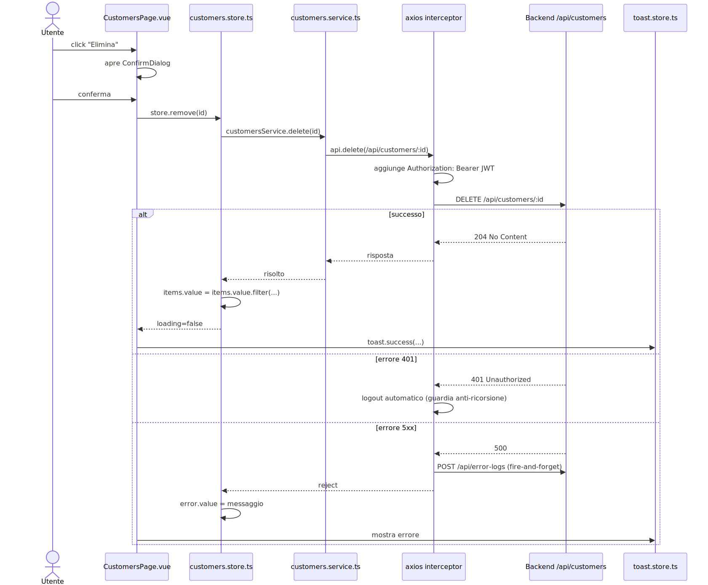

# Frontend — Livello 2: Come funziona

## Struttura di `src/`

```
src/
├── pages/            una cartella per feature: audit-logs, auth, data (accessories,
│                     customers, glazing, ral-colors, series, dashboard), error-logs,
│                     groups, permissions, quotation (drafts, templates, dashboard),
│                     roles, system (configuration, monitoring, dashboard), users
│                     + HomeDashboardPage.vue, GalleryPage.vue, NotFoundPage.vue
├── components/
│   ├── layout/       AppShell.vue (guscio con navbar/sidebar/breadcrumb) e affini
│   ├── shared/        componenti riusabili generici: ConfirmDialog.vue, DataTable.vue,
│   │                  DraftItemDialog.vue, PrintDraftDialog.vue, ServerWakeBanner.vue
│   └── accessories/, series/, users/   componenti specifici di singole feature
├── composables/       usePermission, useApi, useApiErrors, useTheme, useBreadcrumb, useAppVersion
├── stores/            uno store Pinia per feature (users, customers, series, auth, ...)
├── services/          uno per entità, chiamate axios pure (customers.service.ts, ...)
├── router/            index.ts — unica definizione di rotte + guardie
├── plugins/           i18n.ts, msal.ts, vuetify.ts, axios.ts — inizializzazione librerie
├── types/             auth.types.ts, api.types.ts — interfacce TS scritte a mano
├── locales/           it.ts, en.ts — dizionari vue-i18n
├── config/            sections.config.ts — mappa sezioni app → icone/route
├── App.vue, main.ts
```



**Regola pratica**: una feature CRUD tipica tocca sempre gli stessi 4 file: `services/<entità>.service.ts` (chiamate HTTP), `stores/<entità>.store.ts` (stato + orchestrazione), `pages/.../<Entità>Page.vue` (lista) e opzionalmente `pages/.../<Entità>DetailPage.vue` (create/edit).

## Routing e guardie di navigazione

Route definite in `router/index.ts` con lazy loading (`component: () => import(...)`) e metadati per pagina: `requiresAuth`, `permission`, `section` (per evidenziare la voce di menu), `title` (chiave i18n). La maggior parte delle route "vere" sono figlie di `AppShell.vue` (guscio con navbar/sidebar), che a sua volta è montato sotto `/`.

Guardia globale (`router/index.ts`):
```ts
router.beforeEach(async (to) => {
  const authStore = useAuthStore()

  if (to.meta.requiresAuth && !authStore.isAuthenticated) {
    return { name: 'login', query: { returnUrl: to.fullPath } }
  }

  if (to.meta.permission) {
    const permission = to.meta.permission as string
    if (!authStore.permissions.includes(permission)) {
      const toastStore = useToastStore()
      toastStore.warning(i18n.global.t('common.forbidden'))
      return { name: 'dashboard' }
    }
  }
})

router.afterEach((to) => {
  if (to.meta.section) {
    const navStore = useNavigationStore()
    navStore.setSection(to.meta.section as string)
  }
})
```
I permessi sono le stesse stringhe `risorsa.azione` usate lato backend (es. `customers.write`) — coerenza che va mantenuta manualmente quando si aggiunge un permesso (vedi skill di progetto `permissions`).

## State management: Pinia in setup syntax

Tutti gli store usano `defineStore('id', () => {...})` (non l'Options API di Pinia). Pattern ricorrente in ogni store CRUD (es. `stores/customers.store.ts`):

- **state**: `items`, `selectedItem`, `loading`, `error`, `totalCount`, `page`, `pageSize`, `search` (tutti `ref`).
- **actions**: `fetchAll()`, `fetchById(id)`, `create()`, `update()`, `remove()` — ciascuna chiama il service corrispondente dentro un `try/catch/finally` che gestisce `loading`/`error`; i messaggi d'errore passano da `i18n.global.t(...)`.
- `remove()` fa **optimistic update locale** (`items.value = items.value.filter(x => x.id !== id)`) invece di rifare una `fetchAll()`.
- `create()`/`update()` invece richiamano `fetchAll()` per rinfrescare l'intera lista dal server.

`auth.store.ts` è diverso dagli altri: persiste la sessione in `localStorage` (token, scadenza, id/email/nome utente, lingua, permessi) ed espone `login`, `loginWithMsal`, `logout`, `refresh`, `applyLanguage`. Importa il router singleton direttamente per fare `router.push()` dopo login/logout.


## Service layer e client HTTP centralizzato

I service sono oggetti letterali con un metodo per operazione, che ritornano `Promise` tramite `.then(r => r.data)`:
```ts
export const customersService = {
  getAll: (filters: CustomersFilters) =>
    api.get<CustomersPagedResponse>('/api/customers', { params: filters }).then(r => r.data),
  getById: (id: string) => api.get<Customer>(`/api/customers/${id}`).then(r => r.data),
  create: (data: CreateCustomerRequest) =>
    api.post<{ id: string }>('/api/customers', data).then(r => r.data),
  update: (id: string, data: UpdateCustomerRequest) => api.put(`/api/customers/${id}`, data),
  delete: (id: string) => api.delete(`/api/customers/${id}`),
}
```
Il client axios è un **singleton** in `plugins/axios.ts`:
```ts
export const api = axios.create({
  baseURL: import.meta.env.VITE_API_BASE_URL,
  // Nessun Content-Type forzato: axios lo deduce dal payload
  // (forzarlo a application/json rompeva gli upload FormData → 415)
  withCredentials: true,
})

api.interceptors.request.use(config => {
  const authStore = useAuthStore()
  if (authStore.token) config.headers.Authorization = `Bearer ${authStore.token}`
  config.headers['Accept-Language'] = authStore.language ?? 'it'
  useServerWakeStore().start()   // banner "server in riattivazione" (cold start hosting free tier)
  return config
})

api.interceptors.response.use(
  res => { useServerWakeStore().stop(true); return res },
  async error => {
    useServerWakeStore().stop(false)
    const status = error.response?.status
    const isAuthRequest = /* url include /login o /msal-login */
    if (status === 401 && !isLoggingOut && !isAuthRequest) {
      // logout automatico, con guardia anti-ricorsione
    }
    if (status >= 500 && !url.includes('/api/error-logs')) {
      // invio automatico ErrorLog al backend, fire-and-forget
    }
    return Promise.reject(error)
  }
)
```
Questo è il punto **unico** dove: il token viene allegato, un 401 causa logout automatico, e un 5xx viene segnalato al backend come `ErrorLog`.

## Sequenza di una chiamata API dal click utente alla risposta



## Vuetify: tema e defaults globali

`plugins/vuetify.ts` definisce un tema custom (colori `primary` personalizzati, più colori custom come `navigation`/`breadcrumb-bg`/`brand`) per light/dark, e un blocco `defaults` globale che impone `variant: 'outlined'` e `density: 'compact'` alla maggior parte dei componenti input/tabella/lista. Per questo nei singoli componenti raramente si vedono queste props esplicite — sono già il default dell'app.

## i18n

`plugins/i18n.ts` inizializza `createI18n({ legacy: false, locale, fallbackLocale: 'en', messages: { it, en } })`, con la lingua iniziale letta da `localStorage`. I dizionari (`locales/it.ts`, `en.ts`) sono oggetti TypeScript annidati per namespace (`common`, `nav`, `customers.fields.*`, ecc.), non JSON — uso tipico: `const { t } = useI18n(); t('customers.fields.name')`. La lingua viene risincronizzata a runtime nello store auth dopo login o cambio lingua profilo.

## Gestione errori frontend: cosa c'è e cosa manca

Esiste una feature `error-logs` (pagina, service, store) che mostra i log errore letti da `GET /api/error-logs`. L'**unico** invio automatico di errori al backend è quello dell'interceptor axios sulle risposte 5xx (vedi sopra). **Non esiste** un handler globale (`window.onerror`, `app.config.errorHandler`, `unhandledrejection`): un'eccezione JavaScript runtime in un componente, non legata a una chiamata axios, non viene catturata né inviata automaticamente al backend. ⚠️ Lacuna da tenere presente se serve monitoraggio errori client più completo.
