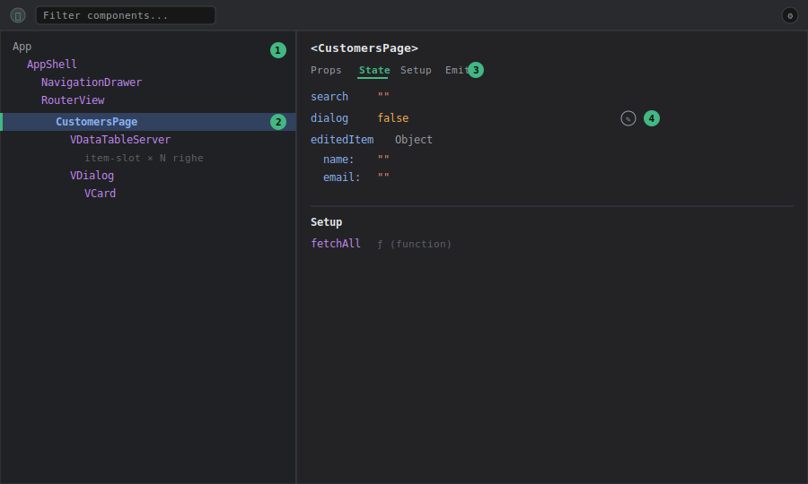

# DevTools — Pannello Components

## Livello 1 — Base

Il pannello **Components** mostra l'albero dei componenti Vue montati nella pagina, rispecchiando la gerarchia con cui sono composti nel template (non i file — un componente può comparire più volte se usato più volte, es. ogni riga di una `v-data-table-server`).

Come aprirlo:
1. Avviare il frontend in dev (`pnpm --filter frontend dev`).
2. Aprire i DevTools del browser → tab **Vue** → sotto-tab **Components**.

Selezionando un nodo dell'albero, il pannello laterale mostra:
- **Props** — i valori passati dal genitore, in sola lettura salvo editing esplicito (vedi Livello 2).
- **State locale** (`ref`/`reactive` dichiarati con `<script setup>`) — su Tama corrisponde a tutte le variabili reattive definite nel `<script setup>` di un file `.vue`, es. `search`, `dialog`, `editedItem` in una pagina lista.
- **Setup** — le funzioni esposte automaticamente da `<script setup>`.
- **Emits** — eventi dichiarati con `defineEmits`.

Sopra l'albero c'è un **selettore a mirino** (icona target): cliccandolo e poi cliccando un elemento nella pagina, DevTools salta direttamente al componente corrispondente nell'albero — utile quando la gerarchia è profonda e non si sa a quale componente appartiene un pezzo di UI.

<strong>Come leggere il pannello</strong> (mockup illustrativo, non uno screenshot reale — i nomi dei componenti/valori sono presi dal codice Tama): 
① <strong>Albero componenti</strong>, a sinistra: gerarchia annidata così come compare nel template (<code>AppShell</code> → <code>RouterView</code> → pagina → componenti Vuetify figli). I nomi in viola sono componenti, non elementi HTML. 
② <strong>Nodo selezionato</strong>: evidenziato con sfondo blu e bordo verde a sinistra; è quello i cui dettagli compaiono nel pannello di destra — qui <code>CustomersPage</code>. 
③ <strong>Tab attiva</strong> nel pannello destro (sottolineata in verde): <code>Props</code> / <code>State</code> / <code>Setup</code> / <code>Emits</code>. Il contenuto sotto cambia in base alla tab, non mostra tutto insieme. 
④ <strong>Icona matita</strong> accanto a un valore: indica che quel valore è modificabile in place (editing live, vedi Livello 2).

## Livello 2 — Intermedio

Workflow tipico su Tama: **capire perché una pagina lista non mostra i dati attesi**.

Le pagine dati di Tama (`pages/data/CustomersPage.vue`, `AccessoriesPage.vue`, ecc.) seguono tutte lo stesso pattern: `<script setup>` con stato locale (`search`, `dialog`, filtri) più un riferimento allo store Pinia del dominio. Aprendo `CustomersPage.vue` nell'albero Components:

- Nel riquadro **State** si vede lo stato locale del componente (es. `dialog`, `editedItem`), separato dallo stato dello store (quello si ispeziona nel pannello Pinia, vedi [devtools-pinia](devtools-pinia.md) — è un errore comune cercare `items`/`loading` qui invece che nello store).
- Nel riquadro **Setup**, la sezione `computed` mostra derivati locali se presenti.

Un secondo workflow frequente: **verificare quali props arrivano a un componente condiviso**. I componenti custom condivisi vivono in `components/shared/`; selezionandoli nell'albero (magari annidati sotto `AppShell.vue` → layout → pagina) si vedono le props effettive ricevute in quel punto specifico dell'albero, utile per capire se un valore sbagliato arriva dal genitore o viene calcolato male all'interno.

**Editing live delle props/state**: cliccando sull'icona matita accanto a un valore nel pannello, si può modificare al volo (es. forzare `dialog = true` per aprire un dialog senza cliccare il bottone, o cambiare `search` per testare il filtro senza digitare). La modifica è reattiva e si propaga come se fosse avvenuta da codice — utile per riprodurre rapidamente uno stato UI specifico durante un bug report.

### Esempio guidato: ispezionare il form di modifica cliente senza compilare nulla

Scenario: si sta lavorando sul dialog di modifica in una pagina lista e serve verificarne il rendering con dati realistici, senza rifare ogni volta il giro click-riga → click-modifica.

1. Aprire `/data/customers`, selezionare `CustomersPage` nell'albero (o usare il mirino puntando la tabella).
2. Nel riquadro **State**, individuare le variabili del dialog (es. `dialog`, `editedItem`).
3. Con la matita, valorizzare `editedItem.name` con una stringa lunga (es. 80 caratteri): serve a testare come il layout del dialog gestisce l'overflow.
4. Forzare `dialog = true`: il dialog si apre con i dati impostati, senza aver toccato la UI.
5. Bonus: con il dialog aperto, riselezionare col mirino un campo del form per ispezionare il componente Vuetify interno (`VTextField`) e verificarne le props effettive (`rules`, `error-messages`, ecc.).

Il tutto è volatile: un refresh della pagina riporta ogni valore allo stato reale. È il modo più rapido per rispondere a "come renderizza il form se...?" senza scrivere codice temporaneo.

## Livello 3 — Avanzato

**"Open in editor"**: ogni nodo dell'albero ha un pulsante che apre il file `.vue` sorgente direttamente nell'editor configurato (richiede il plugin Vite ufficiale, già presente via `vite-plugin-vuetify`/setup standard Vue-Vite). Su un progetto con decine di pagine sotto `pages/data/`, `pages/system/`, `pages/quotation/`, questo evita di cercare manualmente il file quando si parte dall'ispezione visuale.

**Debug di componenti dentro `v-for`**: le tabelle di Tama sono quasi sempre `v-data-table-server` di Vuetify con `item-slot` custom. Ogni cella custom renderizzata via slot compare nell'albero come istanza separata — selezionando una riga specifica si può ispezionare il valore esatto di `item` per quella riga, molto più veloce che mettere un `console.log` dentro lo slot e filtrare l'output per un id specifico.

**Componenti "anonimi" o funzionali**: i componenti Vuetify (`v-dialog`, `v-form`) compaiono nell'albero con il loro nome interno Vuetify, non come parte del markup Tama — utile sapere che se si cerca `CustomerDetailPage` e non si trova subito, potrebbe essere annidato sotto diversi wrapper Vuetify (`v-dialog` → `v-card` → contenuto).

**Accesso al componente selezionato dalla console (`$vm0`)**: quando un componente è selezionato nell'albero, DevTools lo espone nella console del browser come variabile `$vm0`. Da lì si accede all'istanza reale: `$vm0.search`, `$vm0.fetchAll()`, ecc. È il ponte fra ispezione visuale e sperimentazione da console — utile quando l'editing con la matita non basta (es. chiamare un metodo con argomenti, o ispezionare un valore che il pannello tronca). Nota per i componenti `<script setup>` di Tama: le variabili del setup non esposte con `defineExpose` potrebbero non essere raggiungibili direttamente dall'istanza — in quel caso conviene leggere i valori dal pannello State, che invece li vede tutti.

**Performance/re-render tracking**: attivando l'opzione "Highlight updates on components" (impostazioni del pannello, icona ingranaggio), ogni componente che si ri-renderizza lampeggia nella pagina. Su una pagina lista con `watchDebounced` (es. `CustomersPage.vue`, che sincronizza `store.search` con debounce di 300ms — vedi `pages/data/CustomersPage.vue`), questo permette di verificare visivamente che il debounce funzioni davvero: la tabella non dovrebbe lampeggiare ad ogni tasto digitato, solo alla fine della pausa di 300ms. Se lampeggia ad ogni carattere, il debounce non sta funzionando come atteso.
