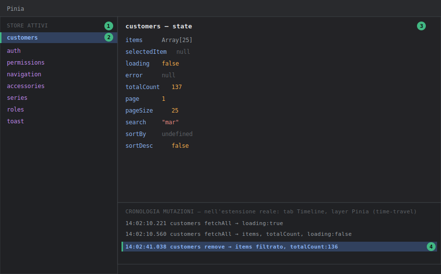

# DevTools — Pannello Pinia

## Livello 1 — Base

Il pannello **Pinia** elenca tutti gli store attivi nell'app (uno per riga, col nome passato a `defineStore('id', ...)`) e per ciascuno mostra lo **state** corrente in tempo reale, come un albero JSON navigabile.

Su Tama ogni dominio dati ha il proprio store in `stores/*.store.ts`, tutti scritti in **setup syntax** (`defineStore('customers', () => { ... return {...} })`, vedi `stores/customers.store.ts`). Nel pannello Pinia questo significa che compaiono solo i valori effettivamente restituiti nel `return` finale dello store — non tutto ciò che è dichiarato dentro la funzione. Se un `ref` interno non viene esposto nel `return`, **non sarà visibile in DevTools**, anche se esiste nel codice.

Come aprirlo: tab **Vue** → sotto-tab **Pinia**. Cliccando su uno store (es. `customers`) si vede il suo state: `items`, `selectedItem`, `loading`, `error`, `totalCount`, `page`, `pageSize`, `search`, `sortBy`, `sortDesc` (tutti i campi esposti da `customers.store.ts`).

<div class="screenshot">

</div>
<p class="caption">
<strong>Come leggere il pannello</strong> (mockup illustrativo con dati di esempio Tama):<br>
① <strong>Elenco store attivi</strong>, a sinistra: uno per ogni <code>defineStore(...)</code> montato — su Tama ce ne sono oltre 15 (<code>customers</code>, <code>auth</code>, <code>permissions</code>, ecc.).<br>
② <strong>Store selezionato</strong> (evidenziato): il suo state completo compare nel riquadro a destra.<br>
③ <strong>Albero dello state</strong>: solo i valori restituiti nel <code>return {...}</code> dello store setup-syntax compaiono qui — un <code>ref</code> interno non esposto non sarà visibile, anche se esiste nel codice.<br>
④ <strong>Cronologia mutazioni</strong> (time-travel): ogni riga è una mutazione con timestamp; cliccandola si può "tornare indietro" allo state di quel momento (vedi Livello 3). Nota: nell'estensione reale questa cronologia non è dentro il tab Pinia ma nel layer <strong>Pinia</strong> del tab Timeline — nel mockup è mostrata accorpata solo per compattezza.
</p>

## Livello 2 — Intermedio

Workflow tipico: **una lista non si aggiorna dopo una create/update e non è chiaro se è un problema di store o di UI**.

Ogni store lista di Tama (`customers.store.ts`, `accessories.store.ts`, ecc.) segue lo stesso pattern CRUD: `fetchAll()` popola `items`/`totalCount`, `create()`/`update()` richiamano il servizio e poi ri-eseguono `fetchAll()`, mentre `remove()` filtra l'array locale senza un nuovo fetch (`items.value = items.value.filter(x => x.id !== id)`, vedi `customers.store.ts` righe 61-65). Con il pannello Pinia aperto sullo store giusto durante l'azione:

- Se `loading` resta `true` dopo l'operazione → l'errore è nel `try/finally` del metodo (es. un'eccezione non gestita prima del `finally`).
- Se `items` non cambia affatto dopo una `create` → il problema è a monte, nella chiamata HTTP (verificare con il tab Network del browser, non DevTools Vue) o nel service layer, non nello store.
- Se `error` si popola con il messaggio i18n (`i18n.global.t('errors.loadCustomers')`) ma la UI non lo mostra → il problema è nel componente che legge `store.error`, non nello store stesso.

Questa distinzione — **stato dello store corretto ma UI che non lo riflette** vs **stato dello store già sbagliato** — è la prima domanda da porsi in ogni bug di dati su Tama, e il pannello Pinia è il modo più rapido per rispondere.

**Editing diretto dello state**: come nel pannello Components, ogni valore è modificabile al volo con l'icona matita. Esempio pratico: forzare `customersStore.error = 'test'` per verificare che il componente lista mostri correttamente il banner d'errore, senza dover disconnettere davvero il backend.

### Esempio guidato: capire perché la lista clienti è vuota

Scenario: si apre `/data/customers` e la tabella è vuota, nessun errore visibile.

1. Pannello **Pinia** → store `customers`. Guardare tre campi nell'ordine:
   - `loading` — se è ancora `true`, la richiesta non è mai terminata (backend lento o bloccato: su Render free tier il cold start può superare i 30s, vedi `server-wake.store.ts` che mostra il banner apposito).
   - `error` — se è valorizzato, la fetch è fallita ma la UI potrebbe non mostrare il messaggio: bug di visualizzazione, non di dati.
   - `items` + `totalCount` — se `items` è `[]` ma `totalCount` è `0`, il backend ha risposto correttamente "nessun risultato".
2. Nel terzo caso, controllare `search`: un filtro di ricerca dimenticato (es. `"mar"` rimasto da una sessione precedente) restituisce legittimamente zero righe. È il classico bug "non è un bug".
3. Per confermare, svuotare `search` con l'editing live (matita → stringa vuota): se `watchDebounced` in `CustomersPage.vue` è attivo, dopo ~300ms parte automaticamente `fetchAll()` e la tabella si ripopola — visibile in diretta nel pannello (`loading: true → false`, `items` che si riempie).

## Livello 3 — Avanzato

**Time-travel debugging**: ogni azione e mutazione Pinia viene registrata come evento nel layer **Pinia** del tab **Timeline** (vedi [devtools-timeline](devtools-timeline.md)). Selezionando un evento passato, il riquadro laterale mostra lo state *in quel momento*; è possibile "tornare indietro" per ispezionare come si è arrivati a uno stato inconsistente, senza dover riprodurre da capo l'intera sequenza di click.

Utile in particolare per lo store `auth.store.ts`, che gestisce sia lo state reattivo sia una copia persistita in `localStorage` (`token`, `permissions`, ecc., vedi `_setSession`/`_clearSession`). Se dopo un refresh token (`refresh()` in `auth.store.ts`) i permessi in UI risultano disallineati, il time-travel permette di isolare esattamente la mutazione che ha aggiornato `permissions.value` e confrontarla con il payload ricevuto dal backend in quel momento (incrociando con il tab Network).

**Store multipli con nomi simili**: attenzione a non confondere store correlati ma distinti, es. `auth.store.ts` (sessione utente) e `permissions.store.ts` (anagrafica dei permessi disponibili nel sistema, usata nelle pagine `system/roles`/`system/permissions`) — nel pannello Pinia compaiono come voci separate (`auth`, `permissions`) e leggere l'una pensando di leggere l'altra è un errore comune quando si debugga l'autorizzazione.

**Store setup-syntax senza `defineStore` "options"**: poiché nessuno store di Tama usa la sintassi a oggetto (`state`/`getters`/`actions`), non esistono "getters" nel senso classico Pinia da cercare in un riquadro separato — i valori computati (es. `isAuthenticated` in `auth.store.ts`, un `computed`) compaiono mescolati nello stesso albero dello state, contrassegnati come computed. Sapere questo evita di cercare una sezione "Getters" che nel pannello, per questi store, semplicemente non esiste.

**Invocare le azioni di uno store dalla console**: il pannello Pinia permette di *editare lo state*, ma non ha un bottone per eseguire le azioni. Per invocare `fetchAll`/`remove` senza passare dalla UI si usa la console del browser, recuperando lo store dall'istanza Pinia dell'app:

```js
// nella console del browser, con l'app in dev
const pinia = document.querySelector('#app').__vue_app__.config.globalProperties.$pinia
const customers = pinia._s.get('customers')   // _s = Map id → store (API interna)
await customers.remove('64f0a1c2...')          // testa l'azione isolata dalla UI
```

`_s` è un'API interna non documentata (può cambiare tra versioni di Pinia), ma in una sessione di debug locale è il modo più rapido per testare un'azione isolandola da eventuali problemi nel bottone/dialog che normalmente la richiama. L'esecuzione comparirà regolarmente come evento nel layer Pinia della Timeline, come se fosse partita dalla UI.
