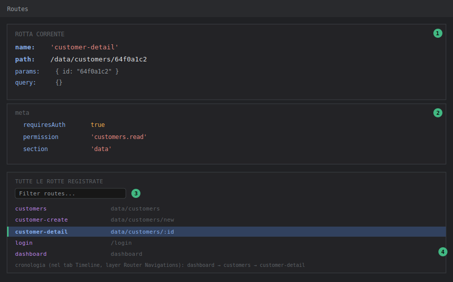

# DevTools — Pannello Router

## Livello 1 — Base

Il pannello **Routes** (in alcune versioni chiamato "Router") mostra:
- La **rotta corrente**: nome, path, parametri (`params`), query string, e l'oggetto `meta` associato.
- L'**elenco completo delle rotte registrate**, ricercabile per nome o path.

Su Tama tutte le rotte sono definite in un unico file, `router/index.ts`, con `meta` che porta tre informazioni chiave usate dalle guardie: `requiresAuth` (booleano), `permission` (stringa, es. `'customers.read'`) e `section` (per evidenziare la voce di menu attiva). Il pannello Router permette di vedere questi valori senza aprire il file sorgente e cercare la rotta a mano tra le oltre 30 definite.

Come aprirlo: tab **Vue** → sotto-tab **Routes**.

<strong>Come leggere il pannello</strong> (mockup illustrativo con dati di esempio Tama): 
① <strong>Blocco rotta corrente</strong>, in alto: <code>name</code>, <code>path</code>, <code>params</code>, <code>query</code> — la rotta effettivamente risolta, non quella richiesta (utile quando i due non coincidono, vedi Livello 3). 
② <strong>Blocco <code>meta</code></strong>: i campi custom definiti in <code>router/index.ts</code> (<code>requiresAuth</code>, <code>permission</code>, <code>section</code>) usati dalle guardie — è qui che si legge il permesso richiesto da una rotta senza aprire il file sorgente. 
③ <strong>Filtro rotte</strong>: cerca per nome/path fra le oltre 30 rotte registrate in Tama. 
④ <strong>Rotta evidenziata</strong> nell'elenco: quella che ha vinto il match per l'URL corrente. La riga di cronologia mostrata sotto nel mockup in realtà non vive in questo tab: la sequenza di navigazioni si legge nel layer <strong>Router Navigations</strong> del pannello Timeline (vedi <a href="devtools-timeline.html">devtools-timeline</a>) — è riportata qui solo per completezza didattica.

## Livello 2 — Intermedio

Workflow tipico: **un utente segnala che, cliccando un link, finisce sulla dashboard invece che sulla pagina attesa, senza errori visibili**.

Le guardie di Tama (`router.beforeEach` in `router/index.ts`, righe 287-304) fanno redirect **silenziosi**: se `meta.requiresAuth` è vero e l'utente non è autenticato, redirect a `login`; se manca il permesso richiesto in `meta.permission`, redirect a `dashboard` con un toast d'avviso (`toastStore.warning(...)`). Nessuna delle due condizioni lancia un errore in console.

Con il pannello Router aperto sulla rotta di destinazione desiderata (es. `data/customers`), si legge subito `meta.permission: 'customers.read'` — a quel punto basta incrociare col pannello Pinia sullo store `auth`, campo `permissions`, per vedere se quella stringa è effettivamente presente nell'array. Se manca, il redirect silenzioso è spiegato: non è un bug del router, è un permesso mancante sull'utente/ruolo di test.

Per ricostruire la **sequenza di navigazioni** che ha portato a uno stato inatteso (specialmente quando è coinvolto un `returnUrl` — vedi `auth.store.ts`, `login()`: dopo il login reindirizza a `router.currentRoute.value.query.returnUrl` se presente), il tab Routes non basta: mostra solo la rotta corrente. Serve il layer **Router Navigations** della Timeline, che registra ogni navigazione con timestamp, rotta di partenza e destinazione (vedi [devtools-timeline](devtools-timeline.md)).

### Esempio guidato: diagnosticare un redirect di permessi in 4 passi

Scenario riproducibile su Tama: un utente di test senza il permesso `customers.read` clicca su "Clienti" nel menu e si ritrova sulla dashboard con un toast di avviso.

1. **Routes** → cercare `customers` nel filtro → leggere `meta.permission: 'customers.read'`. Ora si sa *cosa* serve per entrare.
2. **Pinia** → store `auth` → espandere `permissions`. Se `'customers.read'` non c'è nell'array, il redirect è spiegato.
3. Controprova senza cambiare utente: nel pannello Pinia, aggiungere temporaneamente `'customers.read'` all'array `permissions` (editing live) e ricliccare "Clienti" — ora la pagina si apre. Conferma definitiva che il problema è la configurazione dei permessi (ruolo/gruppo dell'utente su MongoDB), non un bug del frontend.
4. Ricordare che l'editing live è volatile: al prossimo refresh l'array torna quello reale (viene ricaricato da `localStorage`/login). Per la correzione vera bisogna agire su ruoli/gruppi dell'utente (pagine `system/roles`, `system/groups`).

## Livello 3 — Avanzato

**Debug delle rotte lazy-loaded**: tutte le pagine di Tama sono importate con dynamic import (`component: () => import('@/pages/data/CustomersPage.vue')`). Se una rotta risulta "vuota" o mostra una pagina bianca senza redirect e senza errori di permessi, il problema è quasi sempre un errore nel chunk lazy-loaded (es. un import rotto dentro il componente) che il pannello Router da solo non mostra — va incrociato con la tab Console del browser per l'errore di caricamento del modulo, il pannello Router serve solo a confermare che la *rotta* è stata risolta correttamente (nome/path/meta corretti) e quindi il problema è nel componente, non nel routing.

**Rotte con path dinamici sovrapposti**: Tama ha pattern ricorrenti come `data/customers/new` e `data/customers/:id` sullo stesso livello (`router/index.ts`, righe 231-242). vue-router 4 **non** valuta le rotte nell'ordine di dichiarazione: assegna a ogni path un punteggio di specificità, e un segmento statico (`new`) vince sempre su un parametro (`:id`), a prescindere da dove compare nel file. Quindi `/data/customers/new` risolve sempre `customer-create`, non `customer-detail` con `params.id === 'new'`. Il pannello Router resta comunque il modo più diretto per verificare quale rotta *ha effettivamente vinto* il match nei casi meno ovvi: un typo nel link (`/data/customer/64f0...` senza la "s") non matcha nulla e cade nella catch-all `':pathMatch(.*)*'` — nel pannello si vede subito `name: 'not-found'`, che spiega la pagina 404 senza dover ricontrollare ogni `router-link` a mano.

**Correlazione con `navigation.store.ts`**: l'`afterEach` globale (`router/index.ts`, righe 307-312) sincronizza `meta.section` con `navigationStore.setSection(...)`, che pilota quale voce di menu risulta evidenziata in `AppShell.vue`. Se il menu evidenzia la sezione sbagliata dopo una navigazione, il pannello Router conferma se `meta.section` sulla rotta di destinazione è quello atteso; se lo è, il bug è nello store di navigazione o nel componente menu, non nel routing — di nuovo, la stessa logica di "isolare il livello giusto" vista per Pinia.

**Timing delle guardie asincrone**: il guard `beforeEach` di Tama è `async` (usa `await` implicitamente tramite lo store auth, anche se qui non fa fetch di rete). Se in futuro venisse aggiunta una chiamata di rete dentro il guard (es. per validare il token), il pannello Router da solo non mostra lo stato "in attesa" della guardia — per quello serve il pannello Timeline (vedi [devtools-timeline](devtools-timeline.md)), che mostra la sequenza temporale reale di eventi router/network invece che solo lo stato finale.
