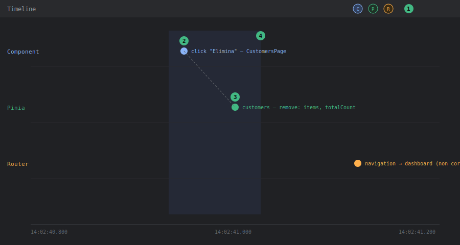

# DevTools — Pannello Timeline

## Livello 1 — Base

Il pannello **Timeline** registra, in ordine cronologico su un unico asse temporale, gli eventi provenienti da più fonti contemporaneamente: mutazioni Pinia, navigazioni router, eventi dei componenti (mount/update), click e, se abilitati, eventi custom (`performance.mark`). È l'unico pannello che mostra **la relazione temporale** fra un'azione utente e le sue conseguenze, mentre Components/Pinia/Router mostrano solo lo *stato corrente*.

Come aprirlo: tab **Vue** → sotto-tab **Timeline**. Le "corsie" (layer) da cui provengono gli eventi sono selezionabili/deselezionabili con le icone in alto — utile per non essere sommersi da eventi irrilevanti (es. disattivare "Component events" se si sta seguendo solo Pinia).

<strong>Come leggere il pannello</strong> (mockup illustrativo con dati di esempio Tama): 
① <strong>Selettore corsie</strong>, in alto: attiva/disattiva gli eventi Component (C), Pinia (P), Router (R) mostrati. 
② <strong>Evento su una corsia</strong> (qui un click su "Elimina" in <code>CustomersPage</code>): posizionato sull'asse orizzontale del tempo, in basso. 
③ <strong>Evento correlato su un'altra corsia</strong> (qui la mutazione Pinia <code>remove</code>): la linea tratteggiata che li collega non è disegnata da DevTools stesso, ma è il tipo di relazione temporale che va cercata leggendo i timestamp dei due eventi — se sono a pochi millisecondi l'uno dall'altro ed è coerente col codice (click → azione store), sono la stessa catena causale. 
④ <strong>Finestra temporale selezionata</strong> (drag sull'asse): isola solo gli eventi avvenuti in quell'intervallo, utile per scartare eventi di sfondo non pertinenti (es. il polling di <code>server-wake.store.ts</code>).

## Livello 2 — Intermedio

Workflow tipico: **verificare che un'azione utente produca esattamente le mutazioni di stato attese, nell'ordine giusto**.

Esempio concreto su Tama: cliccare "Elimina" su una riga di `CustomersPage.vue`. La sequenza attesa, ricostruibile leggendo `customers.store.ts`, è:
1. Conferma dialog → chiamata a `customersStore.remove(id)`.
2. Dentro `remove()`: chiamata HTTP DELETE (`customersService.delete(id)`), poi mutazione sincrona di `items` (filter) e `totalCount--` (righe 61-65).

Sulla Timeline, questo deve comparire come: un evento click, seguito da un evento Pinia "customers" con la mutazione di `items`/`totalCount`, **senza** un evento di navigazione o un secondo fetch di rete in mezzo. Se invece si osserva un `fetchAll()` completo (con relativo evento `loading: true` → `loading: false`) al posto della rimozione ottimistica attesa, significa che il codice non sta più seguendo il pattern "filtra localmente" ma è stato cambiato per ri-fetchare tutto — informazione utile per capire se una modifica recente ha cambiato il comportamento di performance della pagina.

**Filtrare per intervallo di tempo**: la Timeline permette di selezionare una finestra temporale (drag sull'asse) per isolare solo gli eventi avvenuti durante un'interazione specifica, invece di scorrere l'intera sessione di debug.

### Esempio guidato: registrare una sessione pulita dell'eliminazione cliente

La procedura pratica per osservare la sequenza descritta sopra senza rumore:

1. Aprire il tab **Timeline** *prima* di fare qualsiasi cosa (gli eventi precedenti all'apertura non vengono recuperati, vedi Livello 3).
2. Disattivare i layer non pertinenti: per questo caso servono solo **Pinia** e **Mouse** — "Component events" su una pagina con `v-data-table-server` produce decine di eventi di update che coprono il segnale.
3. Cliccare l'icona "Clear" (cestino) per azzerare gli eventi accumulati finora.
4. Eseguire l'azione una sola volta: click su "Elimina" → conferma nel dialog.
5. Fermarsi e leggere: devono esserci il click, l'evento azione `remove` sullo store `customers` e la mutazione di `items`/`totalCount`. Selezionare l'evento Pinia per vedere nel riquadro laterale lo state prima/dopo.
6. Se compare qualcosa di inatteso in mezzo (una navigazione, un `fetchAll` completo, un evento sullo store `toast`), quello è il punto in cui il comportamento reale diverge da quello previsto dal codice — e si sa esattamente dove andare a guardare.

## Livello 3 — Avanzato

**Debug del debounce di ricerca**: `CustomersPage.vue` usa `watchDebounced(() => store.search, ..., { debounce: 300 })` per rilanciare `fetchAll()` solo dopo che l'utente ha smesso di digitare per 300ms. Sulla Timeline, digitando velocemente una stringa di ricerca, ci si aspetta **un solo** evento Pinia di fetch (con `loading` che passa a `true` e poi `false`) circa 300ms dopo l'ultimo tasto premuto — non uno per ogni carattere. Se la Timeline mostra un evento di fetch per ogni pressione di tasto, il debounce non sta funzionando (esattamente il tipo di regressione silenziosa che un `watch` con opzioni scritte male — vedi la nota storica su `{ debounce: 300 } as any` nella documentazione tecnica frontend — può introdurre). Questo è più affidabile del solo "component highlight" del pannello Components, perché mostra anche la relazione con la mutazione dello store, non solo il re-render visivo.

**Correlazione redirect silenziosi ↔ eventi**: per il caso del redirect di `router.beforeEach` verso `login` o `dashboard` (vedi [devtools-router](devtools-router.md) Livello 2), la Timeline mostra un evento di navigazione "annullata/reindirizzata" subito dopo il tentativo di navigazione originale — utile per confermare che il redirect è avvenuto *dentro* la guardia (prima che la rotta target venga mai renderizzata), invece di essere un secondo redirect innescato più tardi da qualche altro codice (es. un interceptor axios che su 401 forza un logout — vedi `plugins/axios.ts`).

**Eventi custom sulla Timeline**: per operazioni non coperte dai layer nativi (es. misurare quanto passa fra il click "Salva" su un preventivo e la risposta del motore di generazione `.docx` lato backend), la Timeline di Vue DevTools supporta layer custom tramite il pacchetto `@vue/devtools-api` (`addTimelineLayer` + `addTimelineEvent`). Attenzione a un equivoco comune: i marker nativi del browser (`performance.mark`/`performance.measure`) **non** compaiono nella Timeline di Vue DevTools — quelli si vedono nel pannello **Performance** di Chrome, che è lo strumento giusto se serve correlare gli eventi Vue con paint/network/main-thread a livello di browser. In pratica: `@vue/devtools-api` per restare dentro la vista Vue, Performance di Chrome per l'analisi completa.

**Misurare i tempi delle azioni Pinia senza librerie**: alternativa leggera per il caso "quanto ci mette davvero `fetchAll`?": ogni evento del layer Pinia ha un timestamp — basta leggere la distanza fra l'evento di inizio azione e la mutazione finale (`loading: false`). Per log più espliciti si può registrare temporaneamente un hook `store.$onAction` (API pubblica Pinia) che logga `after`/`onError` con durata, utile da tenere in un composable di debug attivato solo in dev.

**Limiti da conoscere**: la Timeline registra solo ciò che accade **mentre il pannello è aperto e il layer è attivo** — a differenza del time-travel di Pinia (che mantiene una history anche se il pannello viene aperto dopo), gli eventi Timeline precedenti all'apertura del pannello non vengono recuperati. Per bug intermittenti conviene aprire la Timeline **prima** di riprodurre l'azione, non dopo aver notato il problema.
